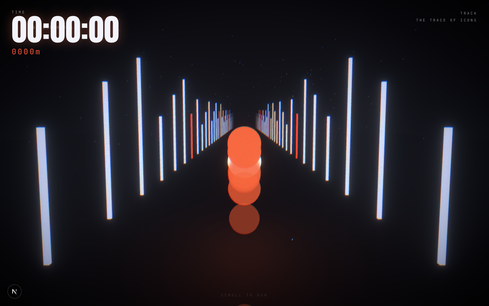

# TRACK — scroll-paced WebGL run

A scroll-driven WebGL experience: a "runner of light" sprints down a neon
corridor while a stopwatch, distance counter, and athlete quotes climb in sync.
Everything — camera, runner, HUD — is driven by **one scroll scalar**, and
reveals are paced to **distance travelled**, not viewport position.

Architecture and stack mirror the techniques observed on
[hirotos.com](https://www.hirotos.com/)'s **TRACK** demo. Built from scratch; no
assets are taken from that site.



## Stack

| Concern          | Choice |
|------------------|--------|
| Framework        | Next.js (App Router, **static export** → `out/`) |
| 3D               | three.js · **react-three-fiber** · drei (`Instances`, `MeshReflectorMaterial`) |
| Post-processing  | **@react-three/postprocessing** — Bloom · ChromaticAberration · Vignette · Noise |
| Animation        | **GSAP** ScrollTrigger + **CustomEase** |
| Smooth scroll    | **Lenis** |
| State            | zustand (one scalar: `progress`) |
| Type             | `next/font` — Anton (display) + JetBrains Mono |
| Hosting          | any static host / nginx — no server runtime, no Vercel required |

## Quick start

```bash
npm install
npm run dev        # http://localhost:3000 — scroll to run
npm run build      # static export → ./out
npm start          # serve the built ./out locally
```

Requires Node 18+.

## How it works

```
scroll ──▶ Lenis (smoothing) ──▶ GSAP ScrollTrigger ──▶ progress (0..1)
                                                          │  zustand store
                 ┌────────────────────────┬──────────────┴───────────────┐
                 ▼                         ▼                              ▼
          Rig (camera)              Spark + Corridor                 HUD (DOM)
        chases the spark        scene scrubbed by distance      stopwatch · metres · quotes
```

1. **`components/ScrollController.jsx`** — Lenis smooths wheel/touch input; GSAP
   ScrollTrigger turns scroll position over a tall (`700vh`) container into a
   `0..1` `progress` and writes it to the store.
2. **`lib/store.js`** — single source of truth. Read imperatively with
   `useProgress.getState()` inside frame/rAF loops, so per-frame updates never
   re-render React.
3. **`lib/ease.js`** — a bespoke **CustomEase** (`trackEase`) shapes how distance
   maps to motion. This is the "metronome" cadence knob.
4. **`components/Rig.jsx` + `Spark.jsx`** — both read the same scalar each frame.
   Stride bob and trail spacing are tied to **distance**, not time.
5. **`components/HUD.jsx`** — DOM overlay updated from one rAF loop; stopwatch,
   distance, and distance-gated quotes all read the same scalar.

## Project layout

```
app/
  layout.jsx        fonts + metadata
  page.jsx          renders <Experience/>
  globals.css       HUD + type system
components/
  Experience.jsx    wires ScrollController + (client-only) Scene + HUD + scroll spacer
  ScrollController  Lenis + GSAP ScrollTrigger → store
  Scene.jsx         <Canvas>, lights, reflective floor, motes
  Corridor.jsx      instanced emissive neon bars
  Spark.jsx         runner-of-light orb + motion trail
  Background.jsx    additive radial glow ("light at the end of the tunnel")
  Rig.jsx           camera chase
  PostFX.jsx        Bloom + ChromaticAberration + Vignette + grain
  HUD.jsx           DOM stopwatch / distance / quotes
lib/
  store.js          zustand progress scalar
  ease.js           CustomEase curve
  constants.js      TRACK_LENGTH, STEP_FREQ, TOTAL_METERS
```

## Customize

- **Real character:** drop a Blender GLB with a baked `run` clip into
  `public/models/` and follow the swap block in `components/Spark.jsx`
  (`useGLTF` + `useAnimations`, scrub clip time by distance).
- **Feel / cadence:** edit the `trackEase` bezier in `lib/ease.js`.
- **Run length:** `TRACK_LENGTH` in `lib/constants.js` + `.scroll-spacer` height
  in `app/globals.css`.
- **Palette:** the accent (`--accent` in `globals.css`) and the emissive colors in
  `Corridor.jsx` / `Spark.jsx` / `Background.jsx`.
- **Glow strength:** `Bloom` `intensity` / `luminanceThreshold` in `PostFX.jsx`.

## Deploy

`npm run build` emits a fully static `out/`. Drop it behind nginx, an S3/CDN
bucket, GitHub Pages, or any static host — no server runtime needed.

## Notes

Educational starter inspired by publicly observable techniques. Ships no assets
from hirotos.com.
